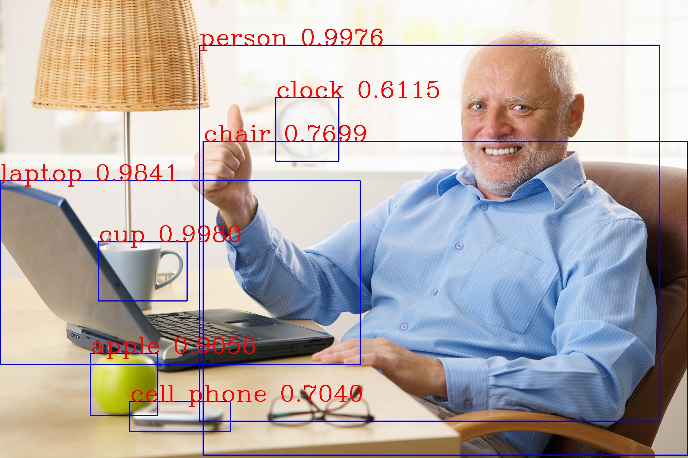
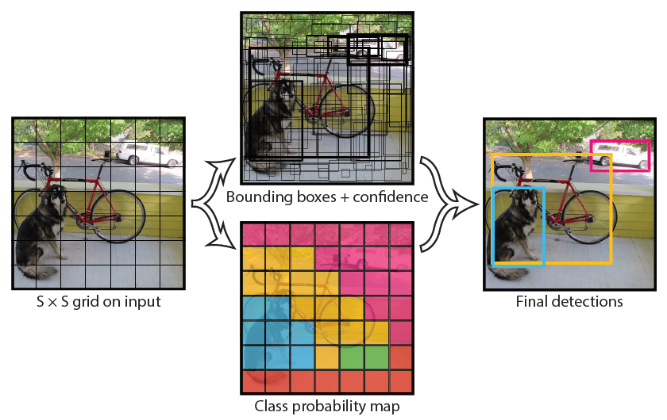
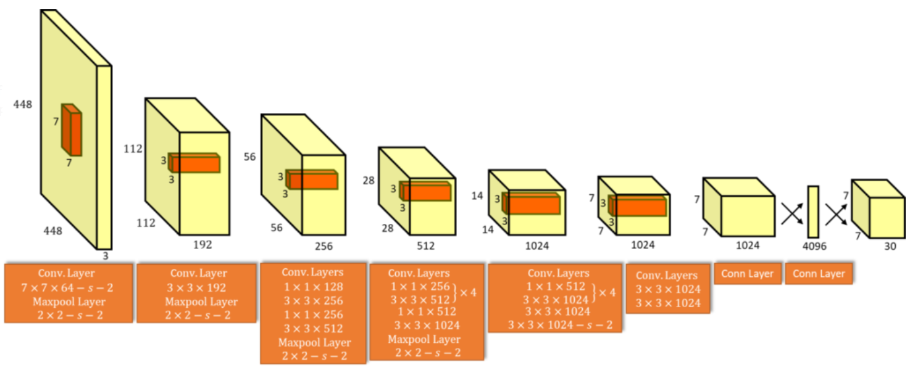
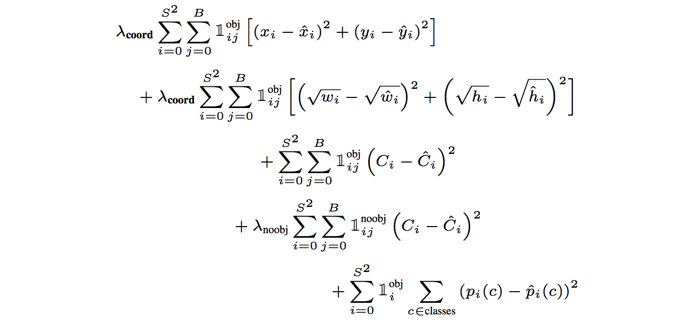
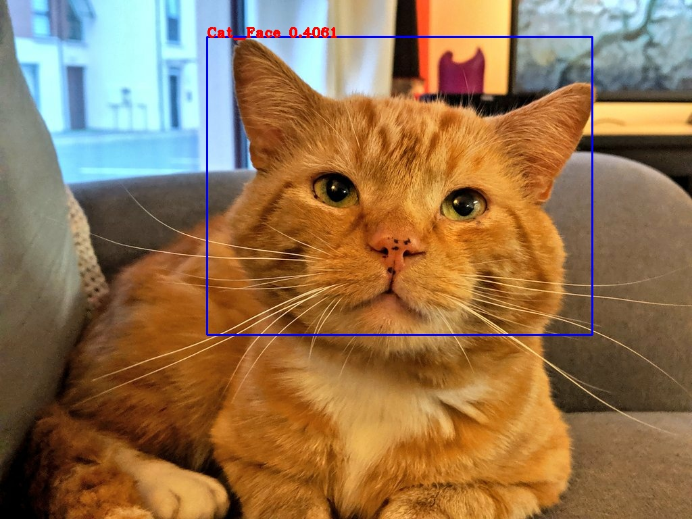
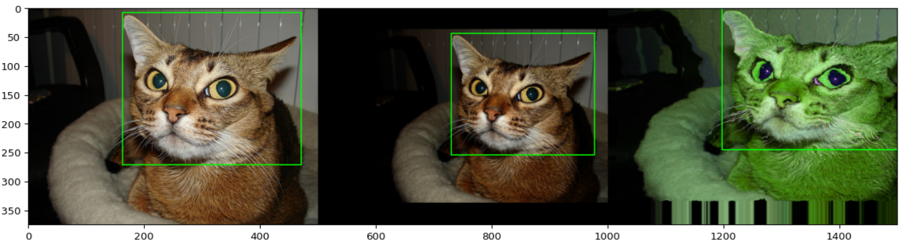

# Object Recognition

## Introduction:

Object detection is a kind of technology related to computer vision and images processing. 

The goal of object detection is to detect and to localize all the instances of objects from kwon classes such as dogs, cars or faces in a given image or video.

For example, such detection may be as following: 



The human visual system is fast and accurate, allowing us to accomplish complex tasks, like flying and driving cars with few worries. Fast, accurate algorithms for object detection have a wide range of applications in a variety of areas: would allow computers and robots to manage real life problems like driving cars without specialized sensors, people counting, vehicle detection and even more, these techniques may be used in the manufacturing industry tasks, and now robots are learning complex tasks just by watching humans do them.

## Object Detection Algorithms for Neural Networks:

Object detection has always been an interesting problem in the field of deep learning. In the beginning, object detection algorithms were implemented using simple templates matching techniques. In nowadays, these techniques fall into either Machine Learning-based approaches or Deep Learning-based approaches. For Machine Learning approaches, we start by extracting the meaningful features of the given image. This step consists of detecting and isolating various portions or shapes of a given image using various approaches such as the Scale Invariant Feature Transform (SIFT) or the Histogram of Oriented Gradient (HOG) features. Then, we use a technique like the Support Vector Machine (SVM) to do the classification.  On the other hand, Deep Learning techniques, are able to do end -to-end object detection without specifically defining the features. This is actually done based on Convolutional neural Networks (CNN). 

A Convolutional Neural Network is a special feedforward network, where hidden units are organized into grid, as in the input, also there is a linear mapping from layer to layer takes form of convolution. The main properties of CNN’s are: multi-scale feature extraction, invariant to certain basic transformations, model the local stationarity (at several scales), …

Current detection systems are primarily performed by employing convolutional neural networks, some examples of this variety of architectures are: R-CNN, SPP, Fast R-CNN, Faster R-CNN, YOLO (YOLO v1, YOLO v2, YOLO v3), …

R-CNN use region proposal methods to first generate potential bounding boxes in an image and then run a classifier on these proposed boxes. After classification, post processing is used to refine the bounding boxes, eliminate duplicate detections, and rescore the boxes based on other objects in the scene. These complex pipelines are slow and hard to optimize because each individual component must be trained separately. Also, we must extract 2 000 regions for each image based on selective search and we also have to extract features using a CNN for each image region, i.e. if we have n images then the number of CNN features will be n*2 000.

A better alternative is YOLO (You Only Look Once) which is a state-of-the-art, real time object detection system. In this architecture, they reframe object detection as a single regression problem, straight from image pixels to bounding box coordinates and class probabilities. Using this system, we only look once (YOLO) to an image to predict what objects are present and where they are. 

In YOLO, the input image is divided into an S x S grid and for each grid cell they predict B bounding boxes, confidence for those boxes and C class probabilities. These predictions are encoded as an 
S x S x (B * 5 + C) tensor. The following figure represents this process. 



In YOLO v1, the detection system has 24 convolutional layers followed by 2 fully connected layers and the final one predicts both class probabilities and bounding box coordinates. Since the detection often requires fine grained visual information, they choose 448 x 448 as input resolution for the network. The following figure represents the full architecture of YOLO v1: 



In YOLO v1, they pretrain their convolutional layers on the ImageNet 1000-class completion dataset. For pretraining, they only use the first 20 convolutional layers from the last figure followed by an average pooling and fully connected layer. Then they train the whole network for approximately a week and they achieve an accuracy of 88% on the ImageNet 2012 validation set. 

YOLO v1 predicts multiple bounding boxes per grid cell. To calculate the loss of the true positive, we need only one bounding box predictor to be responsible for each object. So, we select the box with the highest IOU (Intersection Over Union) with the ground truth. 

During training, they optimize the following, multi part loss function:



This loss is the sum of three other losses: the Classification Loss (for each object detected, the classification loss at each cell is the squared error of the class conditional probabilities for each class), the Localization Loss (it represents the errors between the predicted bounding box and the ground truth) and the Confidence Loss (the object-ness of the box). To get more details about these losses and the above symbols, I invite the reader to have a look to the following [article](https://pjreddie.com/media/files/papers/yolo_1.pdf).

Furthermore, in an object detection problem, choosing YOLO may be a good choice, because its simple architecture makes it fast, efficient for real time processing and ideal for computer vision applications. Also, YOLO detects one object per grid cell. Thus, it introduces some spatial diversity in making predictions, and all of the predictions are made by only one pass over the network. 

Despite these advantages, YOLO has some limitations, for example: it struggles with small objects compared to its close competitors, because it imposes strong spatial constraints on bounding box predictions which limits the number of nearby objects that this model can predict. Finally, since this model learns to predict bounding boxes from data, it struggles to generalize to objects in new or unusual aspect ratio or configurations.

## Implementation:

Since YOLO v1, YOLO v2 and YOLO v3 almost have the same architecture, and that YOLO v3 uses a few tricks to improve training and increase the performance, from now on, I am going to talk only about the implementation of YOLO v3. 

It is pretty much impossible to implement this in TensorFlow from scratch and from the YOLO v3 paper alone. I had to reference to the official repository to have some ideas about the implementation, but it was very hard to understand, and it has not been translated to TensorFlow yet. Then, I had to reference again to many un-official repositories (with many minor errors) in GitHub that I pieced together to complete the whole picture. One of the best repositories that I found and that helped a lot are the following ones [repo 1](https://github.com/zzh8829/yolov3-tf2) and [repo 2](https://github.com/AntonMu/TrainYourOwnYOLO). They have also many minor errors that I corrected later, either using the documentation of TensorFlow or some other repositories that deal with the same subject. 

In order to train our detector to learn how to detect the different objects in an image, such as cat faces in pictures, it needs to be fed with some labeled images which represents our training data. In our example, which is a cat example, this means that we have to label manually cat faces for images located at `yolov3-tf2/data/training_images/cat_images/source_images`. Of course, this is just an example, and we can use another data set, all what we have to do is just to replace the cat images in that folder with another data set. For decent results, it is advisable to label at least 170 objects for training. Obviously, the more data we have, the better results we get.  

To label the different images, I used the Microsoft Visual Object Tagging Tool (VoTT) version 2.1.0 which has release packages for Windows, Mac and Linux available at this [link](https://github.com/Microsoft/VoTT/releases). It can export the bounding boxes and images in different formats: Comma Separated Values (CSV), Microsoft Cognitive Toolkit (CNTK), Pascal VOC, VoTT JSON and TensorFlow Records. For this project, I need my data to be exported in the TensorFlow Records format. Exporting the tagged images under this last will generate one tfrecord file per labeled image which is not very practical, also it does not give the possibility to define the fraction of annotated images that we want to consider as validation data. Actually, these problems are an issue under investigation by Microsoft, so once it is resolved we should export directly in tfrecord format. To avoid these complications, I decided to choose the Pascal VOC format.

Once installed, we create a New Project that we call Cat_Face_Annotation. Then we choose the Source Connection as `yolov3-tf2/data/training_images/cat_images/source_images` and the Target Connection as `yolov3-tf2/data/training_images/cat_images/export` . In the left panel, under the Export Settings we choose the Pascal VOC as Provider and we define the fraction of labelled images that we want to consider as validation data. In my opinion, I think that it is preferable to consider between 20% and 80% of the tagged data as validation ones. 

Once everything is set up properly, we can start labeling cat faces by drawing bounding boxes around cat faces.



Once we have labeled enough cat faces, we press CTRL + E to export the results of annotations. Inside `yolov3-tf2/data/training_images/cat_images/export` we should see a new folder called cat_faces--PascalVOC-export containing three other directories named `Annotations`, `ImageSets` and `JPEGImages` alongside the `pascal_label_map.pbtxt` file.

In my experience, to better train our model, it is of great importance to remember the maximum number of bounding boxes we put per image. For example, in this data set, it is equals to seven, meaning that the maximum number of bounding boxes in each image is less than or equal to seven. Then the “yolo_max_boxes” flag will take the value seven in this case.  

Furthermore, I figured out that the detection may fail when using only one class. Indeed, when training the model with only one output class, the class probability was not trained since the Softmax for a single class will always give one. So, I changed the way the “scores” variable is defined in the “yolo_nms” function. I redefined it so that it is equal to the “confidence” times the “class probs” when the number of classes is strictly greater than one, and it is equal to the “confidence” when dealing with only one class. This is because the class probability is not trained for a single case, so its value will be like zero from the start to the end of the training. 

On another hand, we know that the more data we have, the better will be the performances of our trained model. So, to get good performances and to avoid overfitting, I am going to enlarge and augment my data set using some data augmentation methods. 

Unfortunately, TensorFlow does not natively provide augmentation for both images and bounding boxes, because any transformation that changes the image geometry would need to be applied to the bounding boxes as well, and TensorFlow can not do that. So, defining a custom augmenter is not that trivial. That’s why I made use of the ‘imgaug’ library because it offers support for bounding boxes. For example, if an image is translated or rotated during augmentation, the library can also translate or rotate all bounding boxes on it correspondingly. 

There are a lot of geometric transformations that we can apply to the Pascal VOC data set that we exported, but due to lack of time, I coded just these following ones.



The code I created is available in the file `augment.py`. 

The main idea behind my implementation, is to parse the file Cat_Face_train.txt to get the name of the training images, then I parse each corresponding xml file of these ones to get the coordinates of the true bounding box(es). Next, I applied the above transformations. Then, I finished by saving the new resulting images, creating new xml files containing the coordinate of the transformed bounding box(es) for these last, and adding their filenames to the `Cat_Face_train.txt` file.

Now, to enlarge the original Pascal VOC data set, all what we have to do is to run the following command: 

```bash
python augment.py 
```

Next, from this enlarged data set, we need to transform it to generate the tfrecord files following the TensorFlow Object Detection API. To create the tfrecord file needed for training, we run the following command:

```bash
python tools/voc_cat_face.py \
  --data_dir './data/training_images/cat_images/export/cat_faces--PascalVOC-export' \
  --split train \
  --classes './data/cat_face.names' \
  --output_file ./data/cat_face_train.tfrecord
```
And for validation: 

```bash
python tools/voc_cat_face.py \
  --data_dir './data/training_images/cat_images/export/cat_faces--PascalVOC-export' \
  --split val \
  --classes './data/cat_face.names' \
  --output_file ./data/cat_face_val.tfrecord
```

According to the documentation of YOLO, when we are using any human recognizable images, Darknet pre-training and Transfer Learning will greatly benefit the training process, and it is quite impossible to get good convergence by training the entire YOLO network all at once from random weights. That’s why I am going to train my YOLO v3 model using the Transfer Learning. So, this step requires loading the pretrained Darknet weights and to convert them to YOLO format using the following command:

```bash
wget https://pjreddie.com/media/files/yolov3.weights -O data/yolov3.weights

python convert.py
```

Once finished, we train the network by running:

```bash
!python train.py \
    --dataset ./data/cat_face_train.tfrecord \
    --val_dataset ./data/cat_face_val.tfrecord \
    --classes ./data/cat_face.names \
    --num_classes 1 \
    --mode fit --transfer darknet \
    --batch_size 2 \
    --steps_per_epoch 255 \
    --epochs 150 \
    --yolo_max_boxes 7 \
    --weights ./checkpoints/yolov3.tf \
    --weights_num_classes 80 
```

We have 510 images for training, so I chose to train my model taking the following configuration: `batch_size = 2`, `steps_per_epoch=255` and the training was for `150 epochs`.

Of course, this is just a configuration among others, and to choose the best one, I have to use some libraries like Optuna which is a hyperparameter optimization framework.

Depending on our set up, the process of training can take a few minutes to a few hours. It is preferred to use a GPU to speed up the training phase. The final weights are saved in the checkpoints folder. This is the end of the training step and now we are ready to test our model in new images! 

To get good predictions for the bounding boxes in the test images, it is better to have at most 20 in the validation loss.

After 150 epochs, if there is no overfitting, we can use the last saved model in the checkpoints folder to detect cat faces in new images of cats. To do that, we run the following command: 

```bash
python detect.py \
    --classes ./data/cat_face.names \
    --num_classes 1 \
    --weights ./checkpoints/yolov3_train_84.tf \
    --output ./data/output.jpg \
    --image ./data/test_images/cat_images/5.jpg
```

The obtained result is the following:


The output of the execution of our model is the image above. Our model has successfully detected the face of this cat, also it successfully puts a bounding box around its face. In the top left of the printed box, we have also the confidence score of the detection which is in this case almost 41%. 

Of course, we may improve the detection by adding more images for training and/or fine tuning the different parameters of this model.

We may also need a lower score threshold if we didn’t enough train the model. Indeed, if the IOU Threshold and the Score Threshold were fixed to 0.5 in the file `models.py`, we would not get any result from the past execution, since the confidence score is 0.41 which is less than 0.5.

I strongly invite the reader to take a look to the corresponding notebook named YOLO_v3.ipynb to learn more information about the practical part. 

To conclude, I briefly introduced some object detection systems and mainly YOLO which is a unified model for object detection, simple to construct and according to [article](https://pjreddie.com/media/files/papers/yolo_1.pdf) it is so much fast to detect objects that when attached to a webcam it functions like a tracking system, detecting objects as they move around and change in appearance. Also, I mentioned the Microsoft Visual Object Tagging Tool as being a friendly user tool that can be used to label images and it allows to export the results in different formats.

## References:

 - https://heartbeat.fritz.ai/introduction-to-basic-object-detection-algorithms-b77295a95a63
 - https://github.com/zzh8829/yolov3-tf2
 - https://en.wikipedia.org/wiki/Object_detection
 - https://pjreddie.com/publications/
 - https://pjreddie.com/media/files/papers/yolo_1.pdf
 - https://pjreddie.com/media/files/papers/YOLO9000.pdf
 - https://pjreddie.com/media/files/papers/YOLOv3.pdf
 - https://blog.insightdatascience.com/how-to-train-your-own-yolov3-detector-from-scratch-224d10e55de2


